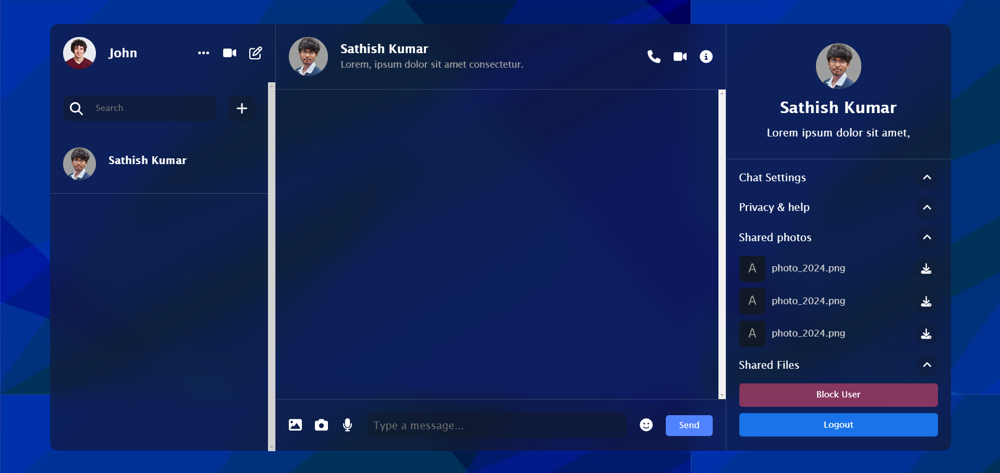
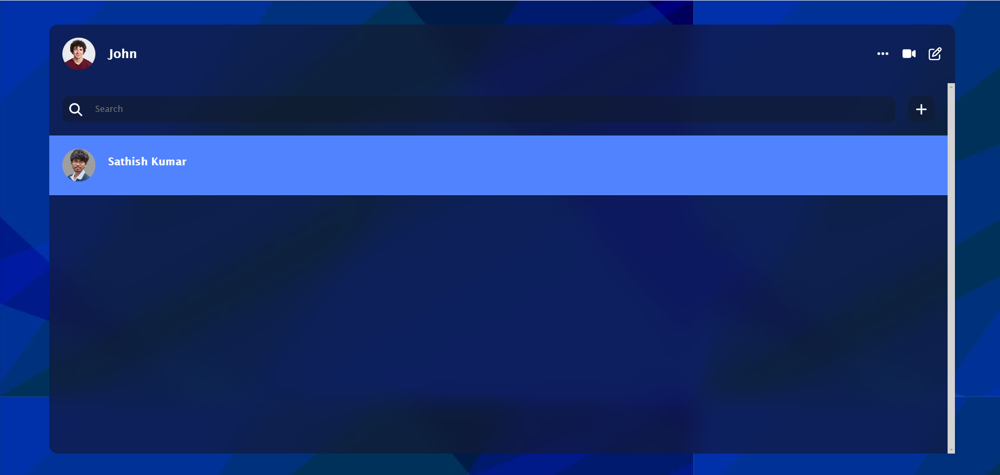
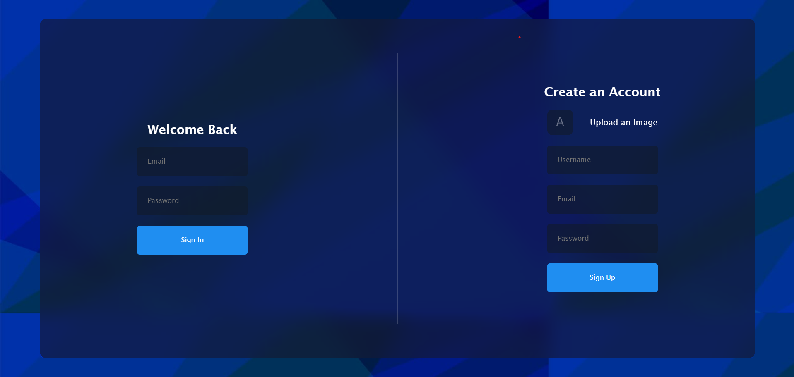

# Chat Application

This is a real-time chat application built using React.js and Firebase.



## Features

- Real-time messaging
- User authentication
- Responsive design
- Easy-to-use interface

## Technologies Used

- **Frontend:** React.js
- **Backend:** Firebase (Firestore for database, Authentication for user login)
- **Styling:** CSS

## Screenshots

### Home Page



### Chat Room


### User Authentication



## Getting Started

### Prerequisites

Make sure you have the following installed:

- Node.js
- npm (Node Package Manager)

### Installation

1. Clone the repository:

   ```bash
   git clone https://github.com/SathishKumar-2004/React-Chat-App.git
   ```

2. Navigate to the project directory:

   ```bash
   cd chat-application
   ```

3. Install the dependencies:

   ```bash
   npm install
   ```

### Firebase Configuration

1. Go to the [Firebase Console](https://console.firebase.google.com/) and create a new project.
2. Add a web app to your Firebase project.
3. Copy the Firebase configuration and replace the placeholder in `src/firebaseConfig.js` with your Firebase configuration:

   ```javascript
   // src/firebaseConfig.js

   const firebaseConfig = {
     apiKey: "your-api-key",
     authDomain: "your-auth-domain",
     projectId: "your-project-id",
     storageBucket: "your-storage-bucket",
     messagingSenderId: "your-messaging-sender-id",
     appId: "your-app-id",
     measurementId: "your-measurement-id",
   };

   export default firebaseConfig;
   ```

### Running the Application

Start the development server:

```bash
npm start
```
